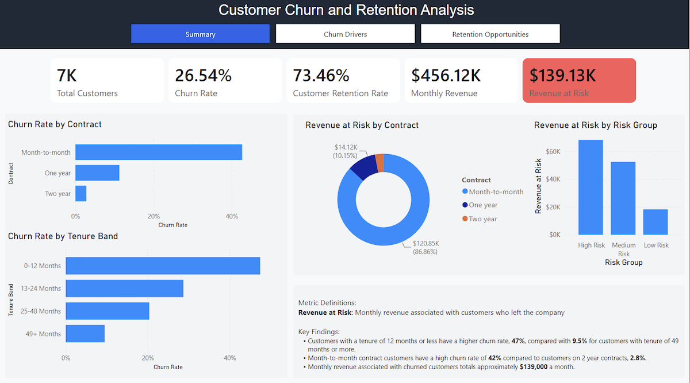
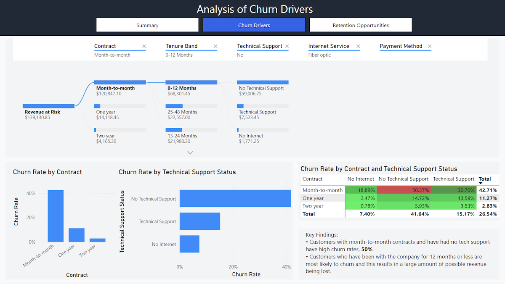
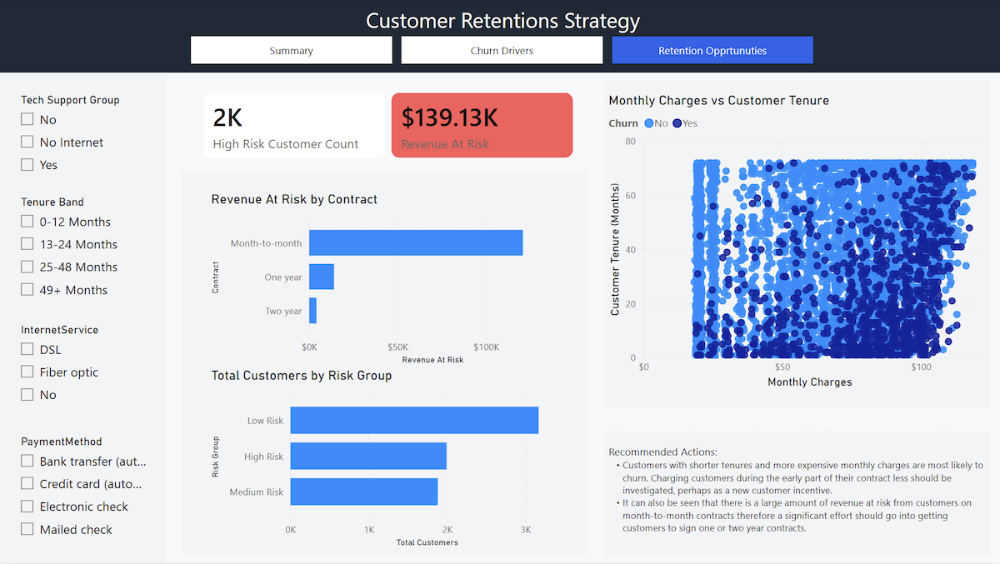

# Customer Retention Analysis

## Overview

In this project customer churn, revenue at risk and retention opportunities from the IBM Telco database  are analysed using Power BI. 

## Key Finding

 - Customers with month-to-month contracts have a churn rate of **42%** much greater than customers on two year contracts, **2.8%**.
 - Customers who have been with the company for 12 months or less have a churn rate of **47%** compared to customers who have a tenure of greater than 49 months, **9.5%**  
- The total amount of monthly revenue that is at risk to customer churn is **$139,000**
- Customers who have higher monthly costs and shorter tenures are more likely to churn
- Key recommendations include investigating lower introductory prices for new customers and incentivising customers to move from month-to-month contracts to longer-term contracts.

## Tools used

- DAX
- Power BI
- Power Query

## Report Pages

### Summary

- An overview of factors affect customer churn rate.  
- Visual representations of monthly revenue associated with customers who have left the company, labelled revenue at risk.
    

### Analysis Of Churn Drivers

- Decomposition tree, showing what factors, such as contract type, lead to the the largest amount of revenue at risk.  
- Heatmap used to explain churn rate.
    

### Customer Retention Strategy

- Possible routes to minimising customer churn are explored
   

## Data Source

- The dataset for this project comes from https://www.kaggle.com/datasets/blastchar/telco-customer-churn.  
- The dataset contains information about customers from a fictonal telecommunications company Telco, including demographics, contract type and billing.

